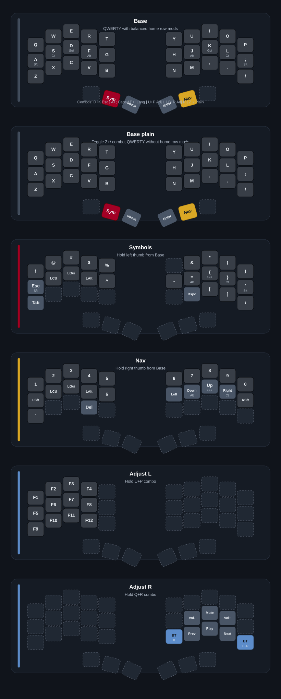

# Ergohaven ZMK config

ZMK firmware configuration for the Ergohaven **OP36** split keyboard.

The default `op36` keymap is the RU/EN layout from `config/op36.keymap`: normal QWERTY letter positions, balanced home row mods, a plain base layer toggle, and split Adjust layers.

## Build

1. Fork this repository.
2. Push changes to your fork.
3. Open the **Actions** tab and wait for the firmware build to finish.
4. Download the `firmware` artifact and unzip it.

`build.yaml` builds both halves:

| File | Half |
| --- | --- |
| `ergohaven_op36_left-*.uf2` | Left half |
| `ergohaven_op36_right-*.uf2` | Right half |

## Flash

1. Connect the half you are flashing with a USB cable.
2. Enter the bootloader on that half:
   1. Double-click the reset button.
   2. Quickly short the reset button twice if the button is unreliable.
   3. Quickly short **GND** and **RST** on the controller twice if needed.
3. Copy the matching UF2 file to the bootloader drive.
4. Repeat for the other half.

## Keymap overview

*Diagram mirrors `config/op36.keymap` and is generated by `python3 gen_svg.py`. Editable draw.io source: [`assets/op36-layout.drawio`](assets/op36-layout.drawio).*

The layout stays close to a full-size keyboard: QWERTY letters on Base, familiar punctuation on Symbols, and numbers/navigation on Nav. Home row mods are the main ergonomic adaptation; **Base plain** keeps the same QWERTY layout without hold-tap home row mods.

Home row mods use balanced hold-tap (`hml` / `hmr`) on **A S D F** and **J K L ;**.

**Combos:** **Esc** (`D+K`), **Caps Lock** (`A+;`), **Lang** (`E+I`, `LG(SPACE)`), **Adjust L** (`U+P`), **Adjust R** (`Q+R`), and **Base plain** toggle (`Z+/`). See `combos` in `config/op36.keymap` for exact key positions.

| Layer | How you get there | Role |
| --- | --- | --- |
| **Base** | Default | QWERTY with home row mods; left thumb holds **Symbols**, right thumb holds **Nav**. |
| **Base plain** | Toggle `Z+/` combo | QWERTY base layer without home row mods; keeps the same Symbols, Space, Enter, and Nav thumbs. |
| **Symbols** | Hold left thumb from Base/Base plain | Punctuation and symbols; includes Tab and Backspace. |
| **Nav** | Hold right thumb from Base/Base plain | Numbers, arrows, navigation keys, and modifiers. |
| **Adjust L** | Hold `U+P` combo | Function keys **F1-F12**. |
| **Adjust R** | Hold `Q+R` combo | Bluetooth slot 0, Bluetooth clear, volume, and media controls. |

## Repository layout

| Path | Purpose |
| --- | --- |
| `build.yaml` | GitHub Actions build matrix. |
| `config/west.yml` | West manifest entry point. |
| `config/op36.keymap` | Main OP36 keymap. |
| `config/op36.conf` | OP36 ZMK config options. |
| `config/op36_qube.conf` | Qube/pointing variant options. |
| `config/keys_ru.h` | Russian layout key definitions. |
| `gen_svg.py` | Regenerates the OP36 keymap diagram assets. |
